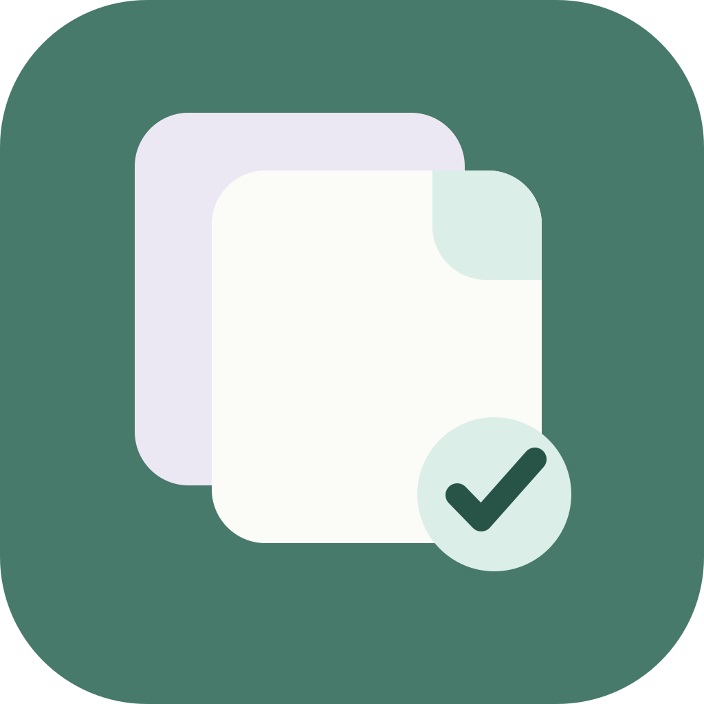
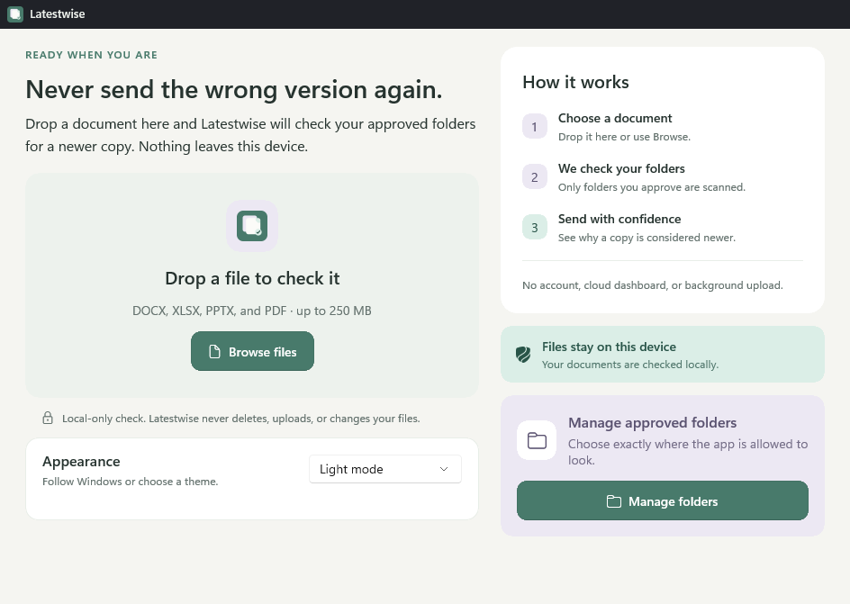
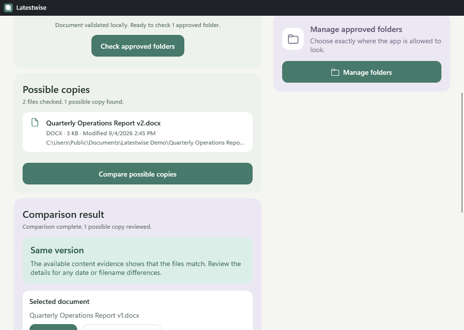
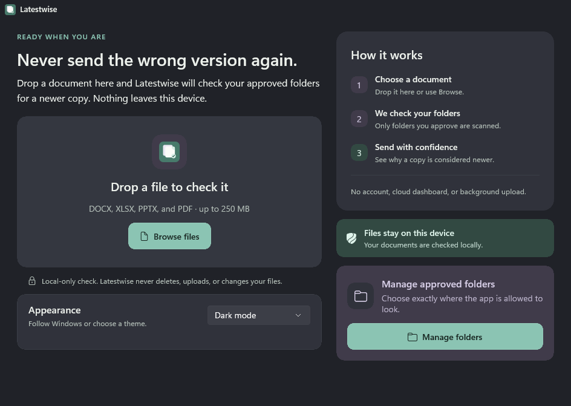
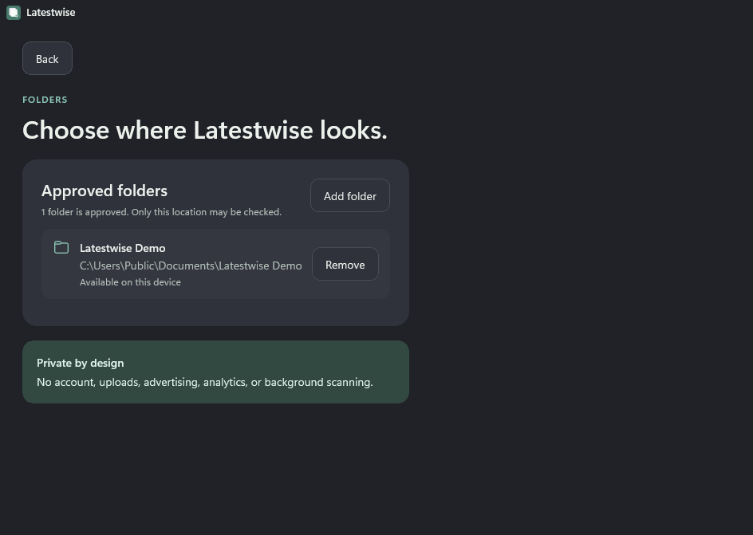

  

<h1 align="center">Latestwise</h1>

  Check approved folders for newer copies of Office documents and PDFs, entirely on your PC.

  <strong>Private by design. Clear about uncertainty. Safe with your files.</strong>

## Never send the wrong version again

Folders often contain files such as `Report Final.docx`, `Report Final 2.docx`, and `Report Final New.docx`. Filenames and modified dates alone do not always reveal which copy should be used.

Latestwise checks a selected document against folders you approve. It examines local evidence and explains whether a newer or closely related copy may exist. When the evidence is incomplete or conflicting, Latestwise says so instead of guessing.

## How it works

1. Approve the folders Latestwise may check.
2. Select or drop a DOCX, XLSX, PPTX, or PDF document.
3. Review possible copies and the evidence used for comparison.
4. Open the appropriate document or locate it in File Explorer.

Latestwise never replaces, renames, moves, or deletes your documents.

## Evidence you can understand

The comparison workflow considers bounded local content, document structure, fingerprints, filename relationships, file size, and modification information. Results include a written explanation, so meaning never depends on color alone.

## Private by design

- No account is required.
- Documents are not uploaded.
- Only folders approved by the user are checked.
- No advertising or usage analytics are included.
- No background scanning takes place.
- Online-only cloud files are not downloaded automatically.
- Document changes are never made by the application.

## Light and dark appearance

Latestwise follows the Windows appearance by default and also supports explicit light and dark preferences.

## Download

The official Windows 11 release is available from [GitHub Releases](https://github.com/KSAGlory/Latestwise/releases).

Latestwise is free to use as a compiled application. Its source code remains private and proprietary. This public repository contains only reviewed product information, support documentation, presentation assets, and official compiled releases.

## Requirements

- Windows 11 version 22H2 or newer
- x64 or ARM64 desktop system
- Local access to the documents and folders you choose to check

**ARM64 notice:** The ARM64 build is included but has not been validated on physical ARM64 hardware. x64 is the officially tested configuration.

## Author and Community

- Author: **KSAGlory**
- Community: [discord.gg/ksahub](https://discord.gg/ksahub)

## License

Latestwise is proprietary software. See the [product notice](LICENSE.md) for the permitted use and restrictions.

Copyright © 2026 KSAGlory. All rights reserved.
